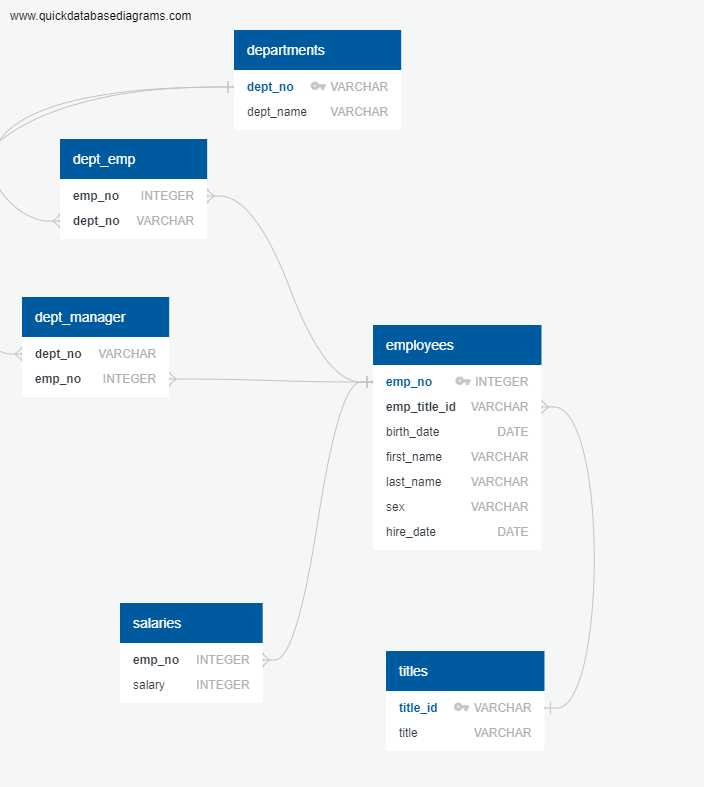
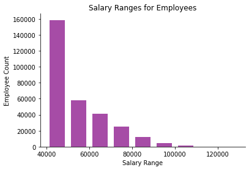
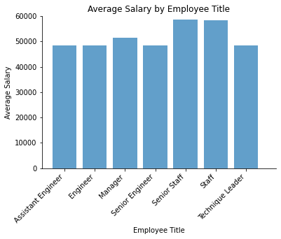

# SQL-Challenge

For this homework, we were asked to import 7 tables from a company with employee records using SQL, and then analyze the data with some simple queries. The first step was to make a schema, so when the tables get imported, SQL knows what structure they should have. The tables imported consisted of the following data:

* Departments

* Department and Employees (dept_emp)

* Department Managers (dept_manager)

* Employees

* Salaries

* Titles

After analyzing the data to be imported, we wanted to visualize how the data would be organized, so we were asked to use [QuickDB Diagrams](https://app.quickdatabasediagrams.com/#/d/8e2Z6R) to make an ERD of our table schema. I have linked the QuickDB Diagrams website for a better look at how I made [my ERD]("EmployeeSQL/Employee_Tables_Schema.sql"). I have also included the screenshot of it below for quick reference: 

After making my ERD, then I had to make my official schema in SQL, defining the table names, values and type of values, foreign keys, and primary keys for each table. The code for the table creation can be found [here]("EmployeeSQL/Employee_DB_Creation.sql"). Once this was all completed, I just had to import each table data from the 6 tables we were provided, using PgAdmin 4.

## Data Analysis/Queries

The next part of the homework included a series of questions that would be completed by using SQL queries for the imported employee data. Most of them included calling multiple tables to get the information desired. My SQL queries can be found [here]("EmployeeSQL/Employee_Data_Query.sql"), where I answered the 8 questions we were asked.

### 1. Employee Details

We were asked to list employee number, last name, first name, sex, and salary. This was done by obtaining last name, first name, and sex from the employees table, and then getting salary from the salaries table. Then, we just had to join the two tables on the common column, which was employee number. I chose to order the outputs by employee number to have a more organized output.

### 2. Employees Hired in 1986

This question asked us to list the first name, last name, and hire date for employees hired in 1986, which only required us to use the employees table for information. I just had to split up the date by year, since it was in Date/Time format, to be able to specify the year I wanted to get for employee hire dates. Lastly, I ordered it by the hire date to see the employees hired in order from January to December of 1986.

### 3. Listing the Manager of Each Department

We had to get the department number, department name, manager employee numbers, last names, and first names. This required using the dept_manager, departments, and employees tables to get the desired output. I simply joined departments and dept_manager on department number, and then joined the employees and dept_manager tables on employee number, ordering it by department number to see the department names in organized groups. 

### 4. Listing the Employees' Departments

For this part, we were required to get the department name, employee number, last name, and first name. This step also required us to use 3 tables, this time the employees, dept_emp, and departments tables. To get them to output all these columns, I simply specified the ones I wanted and then joined dept_emp and employees on employee number, and then joined departments and dept_emp on department number. Lastly, I ordered this by employee number for organization and clarity.

### 5. Listing Employee Info (First Name: Hercules, Last Name: starts with a B)

This query consisted of finding employee details for those whose first names are 'Hercules', and have last names starting with 'B'. I only needed to use the employees table to get this information, and then specify what their first name had to be, as well as what letter their last name should start with, and outputted their first name, last name, and sex. Then I ordered this alphabetically by last names, since all the first names were the same.

### 6. Sales Employees Info

We were asked to find the employee information of those working in Sales with their employee number, last name, first name, and department name. This step was a bit more intricate, as it consisted of joining 3 tables together: employees, dept_emp, and departments. First, I joined the dept_emp and employees tables on employee number, and then departments and dept_emp on the department number. Next, I specified what the department name should be, which in this case was Sales to get the Sales employees. Lastly, I ordered it by employee number for clarity.

### 7. Sales and Development Employees Info

To get the information of employees in Sales and Development, I had to follow the same steps above to join the same 3 tables. However, instead of specifying just Sales for the department name, I specified that it could be either Sales or Development. I also ordered these results by emmployee number for organization.

### 8. Frequency Count of Last Names

For the last data query, we were asked to get the frequency count of employee last names. I only had to use the employees table for this, but I had to count the last name column within it, and output the results to a new column I created called "last_name_count". Then, I grouped this by the employee last names, and sorted it in descending order, meaning the last name counts would be shown in order of highest to lowest occurrences.

## Bonus

After creating the database, making the schemas and tables, importing the data, and getting our data queries, we were asked to complete a bonus part that consisted of creating visualizations for the data results. This part consisted of using SQLAlchemy to import my existing database, and then output those as dataframes to make calculations and visualizations from, making sure to convert any parsed values such as dates to be read in properly. Then, I made a histogram of the salary range data using the salary column from the salaries table, and after getting the maximum and minimum values of the data, I binned into 10 salary ranges to get a better visualization of how the data is spread out, and properly labeling axises and titles for clarity:

For the last part of the bonus, we were asked to create a bar chart of the average salaries by title. This part was a little bit more complicated, since it required merging 3 dataframes together. I started by merging employees and titles on title id, after changing the employees column name from 'emp_title_id' to 'title_id', to make it a smooth merge. Then, I merged salaries into it on the employee number column. I also had to call the columns I wanted from that dataframe, which were: employee number, title, and salary, so I could group it all by title and get the average salaries for employees. 

